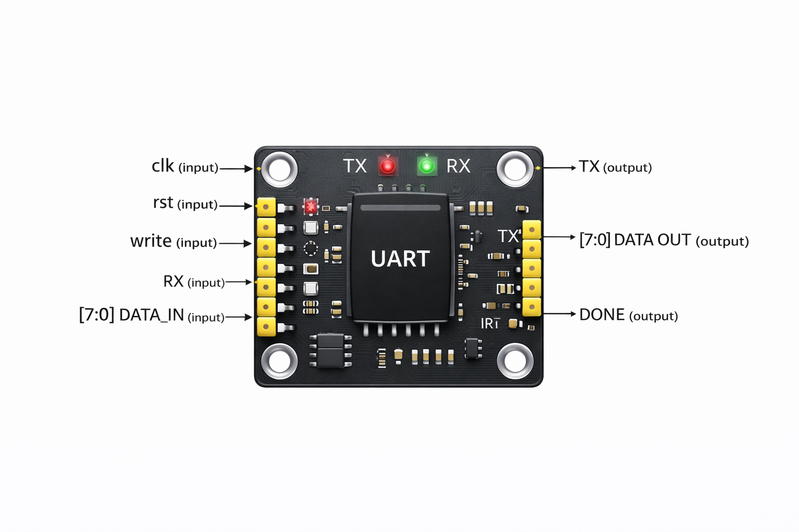

# UART (Universal Asynchronous Receiver Transmitter) – Verilog Implementation
## Abstract

In this project we will design the Universal Asynchronous Receiver Transmitter (UART) using Verilog HDL. UART is the most commonly used communication device in digital systems. It provides the communication between the different systems using asynchronous serial communication. It receives the parallel data from the transmitting device, changes it into the serial data and then transmits it. It again converts the serial data into parallel data at the receiving end. The UART circuit consists of transmitter circuit and receiver circuit and also the top level UART module.

## Introduction

UART (Universal Asynchronous Receiver-Transmitter) is the most widely used serial communication protocol in embedded systems, FPGA designs, System-on-Chip (SoC) etc. UART supports full-duplex communication i.e. the transmitter and receiver do not have a common clock.

The Clean RTL implementation of a UART is available from: https://github.com/CleanRTL/CleanRTL/blob/master/project_uart.v The project_UART.v code demonstrates how to develop a serial communication system

## Objectives

Design an 8-bit UART transmitter in Verilog

Design an 8-bit UART receiver in Verilog

Integrate both modules into a single top-level UART module

Develop a modular and synthesizable RTL architecture

Ensure clear signal interfacing between transmitter and receiver

## System Architecture

The design consists of three main components:

Transmitter module

Receiver module

Top-level UART module

The top-level module instantiates the transmitter and receiver and wires the control signals inside.

The transmitter performs parallel-to-serial conversion, while the receiver performs serial-to-parallel conversion.

## Block Diagram

## Top-Level Module: uart
### Inputs

clk – System clock

rst – Active-high synchronous reset

write – Transmission start control

rx – Serial receive input

data_in[7:0] – 8-bit parallel data input

### Outputs

tx – Serial transmit output

data_out[7:0] – 8-bit parallel received output

done – Reception completion signal

## Functional Description
### Transmitter

Accepts 8-bit parallel data

Serializes input data

Transmits serial data through tx

Generates internal busy signal during transmission

### Receiver

Samples incoming serial data on rx

Converts serial stream into 8-bit parallel output

Asserts done after successful reception

## Design Characteristics

Modular RTL design

Clear separation of transmission and reception logic

Synchronous reset implementation

Synthesizable Verilog code

Scalable for future feature additions

## Applications

FPGA-based serial communication

Embedded system interfaces

SoC peripheral communication

Debug communication interface

Hardware communication subsystem for RISC-V or AES integration

Future Enhancements

Configurable baud rate generator

Parity bit implementation

Stop bit configuration support

FIFO buffering

Interrupt-based reception

FPGA hardware validation
